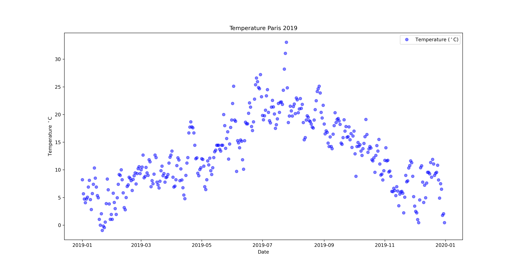
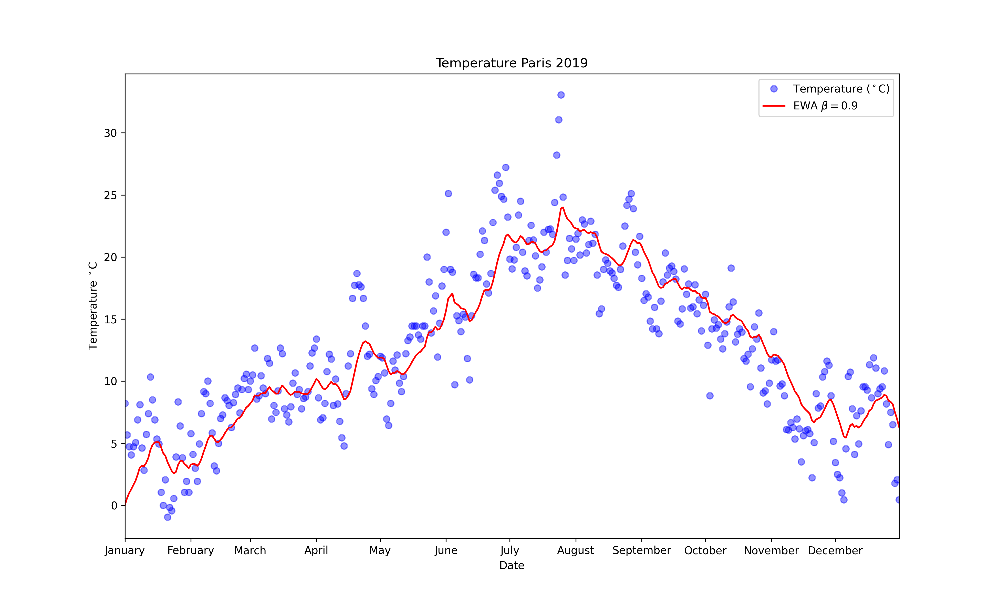
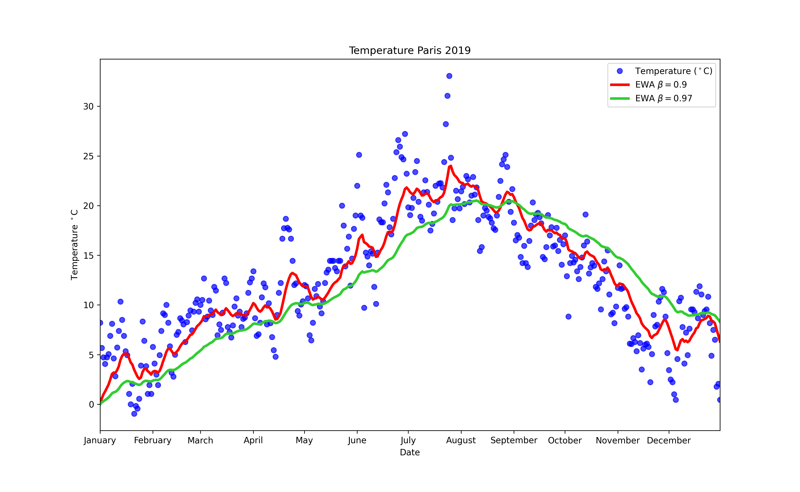
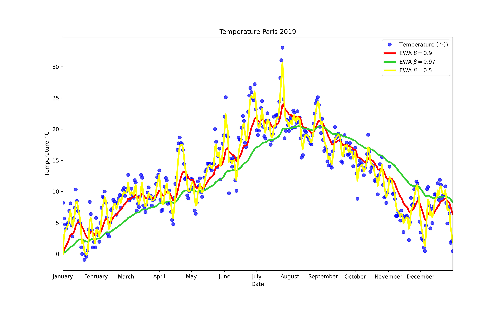

# Exponentially Weighted Average

The Exponentially Weighted Moving Average (EWMA) is a quantitative or statistical measure used to model or describe a time series, but it's also part of one of the well known optimization algorithm of Deep Learning: *Gradient Descent with Momentum*.

In order to compute the EWMA you must define one parameter $\beta$. 
This parameter decides how important the current observation is in the calculation of the EWMA.

$$
\beta \searrow \quad  \Longrightarrow \quad \text{EWMA tracks more closely the original trend}
$$

Lets make an example based on the temperatures of Paris, France, in 2019.

Define:
- $\beta$ := Weight parameter
- $\theta_t$ := Temperature day $t$
- $W_t:=$  EWMA for day $t$ (set $W_0 = 0$).

For this example supose that $\beta = 0.9$, so the aim of the EWMA its to combine the temperature of the current day with the previous temperatures.

$$
W_1 = \textcolor{red}{0.9}\cdot W_0 +  \textcolor{red}{0.1}\cdot\theta_1 \\
W_2 = \textcolor{red}{0.9}\cdot W_1 +  \textcolor{red}{0.1}\cdot\theta_2 \\
\vdots \\
W_t = \textcolor{red}{0.9}\cdot W_{t-1} +  \textcolor{red}{0.1}\cdot\theta_t
$$

In general to compute the <a name =equation>  EWA </a> for given parameter weight $\beta$  we use

$$
W_t = \begin{cases}
0 & t =0 \\

\textcolor{red}{\beta}\cdot W_{t-1} +  (\textcolor{red}{1-\beta})\cdot\theta_t & t > 0
      \end{cases} 
$$ 

If we plot this in red, we can see that what we get is a moving average of the daily temperature, it's like a smooth, less noisy curve.

Lets explain a bit more the general equation:

$$
W_t = \underbrace{\textcolor{red}{\beta}\cdot W_{t-1}}_{\text{trend}} +  \overbrace{(\textcolor{red}{1-\beta})\cdot\theta_t}^{\text{current value}}
$$

We can see that the value of $\beta$ determines how important its the previous value (the trend), and $(1-\beta)$ its the importance of the current value.

Take a value of $\beta = 0.98$ and plot it in green, notice that the curve is much *smoother* because the trend now is more important (and the current temperature value is less important), so it will adapt more slowly when the temperature changes. 

Lets try the other extreme and set $\beta = 0.5$, by this way the graph you get its much more *noisy*, because it is more susceptible to the current temperature (and this includes outliers).

But it adapts much more quickly to changes in temperature.

If you want to understand the meaning of the parameter $\beta$, you can think of the value 

$$n_{\beta} = \dfrac{1}{1-\beta}$$

 as the numbers of observations used to adapt your EWA.

 | $\beta$ 	| $n_{\beta}$ 	| EWA 	|
|---	|---	|---	|
| 0.9 	| 10 	| Adapts normal 	|
| 0.98 	| 50 	| Adapts slowly 	|
| 0.5 	| 2 	| Adapts quickly 	|

In order to go a little bit deeper into the intuitions of what this algorithm actually does. 

Lets expand the 3th term ($W_{3}$) using the <a name =equation>  [main equation](#equation)  </a>:

$$
W_3 = \textcolor{red}{0.9}\cdot W_2 + \textcolor{red}{0.1}\cdot\theta_{3}\\
W_2 = \textcolor{red}{0.9}\cdot W_1 + \textcolor{red}{0.1}\cdot\theta_{2}\\
W_1 = \textcolor{red}{0.9}\cdot \underbrace{W_0}_{0} + \textcolor{red}{0.1}\cdot\theta_{1}
$$

Plugin $W_1$ in $W_2$ and then in $W_3$:

$$
W_{3} = \textcolor{red}{0.9}\cdot \underbrace{(\textcolor{red}{0.9}\underbrace{(\textcolor{red}{0.9}\cdot 0 + \textcolor{red}{0.1}\cdot\theta_{1})}_{W_1} + \textcolor{red}{0.1}\cdot\theta_{2})}_{W_2} + \textcolor{red}{0.1}\cdot\theta_{3}
$$

Simplifying

$$
W_3 = \textcolor{red}{0.1}(\theta_3 + \textcolor{red}{0.9}\theta_2 + \textcolor{red}{0.9^2}\theta_1)
$$

Here it is quite clear what the roll of  $\beta = 0.9$ parameter is in EWA, we can see older observations are given lower weights. The weights fall exponentially as the data point gets older hence the name exponentially weighted.

In general we have:

$$
W_t = (1-\beta)(\theta_t + \textcolor{red}{\beta}\cdot \theta_{t-1} + \textcolor{red}{\beta^2}  \cdot\theta_{t-2}+ \dots + \textcolor{red}{\beta^{t-3}}\cdot\theta_{3} + + \textcolor{red}{\beta^{t-2}}\cdot\theta_{2} + + \textcolor{red}{\beta^{t-1}}\cdot\theta_{1} ) 
$$

or the closed formula:

$$
W_t = (1-\beta) \cdot\sum_{k = 1}^{t} \beta^{t-k}\theta_k
$$

If you are visual learner, this is another approach:

Rewrite $W_t$ using the dot product ($*$):

$$
W_t = \textcolor{red}{(1-\beta)} \cdot
(\textcolor{red}{\beta^0,\beta^1, \dots,\beta^{t-2},\beta^{t-1}}) * (\textcolor{blue}{\theta_t, \theta_{t-1}, \dots, \theta_2, \theta_1})
$$

